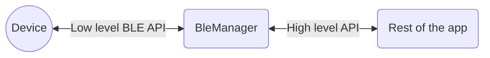

# Usage 

A [BleManager](https://github.com/NordicSemiconductor/Android-BLE-Library/blob/main/ble/src/main/java/no/nordicsemi/android/ble/BleManager.java)
instance is responsible for connecting and communicating with a single Bluetooth LE peripheral.
By having multiple instances of the manager it is possible to connect to multiple devices simultaneously.
Different Android devices have different maximum limit of connections, usually oscillating around 6.
It is possible to reuse the same manager instance to connect to a new peripheral
after the previous one was disconnected, but we recommend to create a new instance.

The `BleManager` must be extended with your implementation where you define the high level device's API.



The methods that need to be implemented are:
1. `isRequiredServiceSupported(BluetoothGatt gatt)` should search for required service(s) in
   `gatt.getServices()`. This method should return whether the service and all characteristics are found.
   This method should also acquire references to `BluetoothGattCharacteristic`s used by the manager.
2. `onServicesInvalidated()` should release the references as no longer valid. This method is called when
   the device has disconnected or invalidated services.
3. `initialize()` should initialize the device. This may include enabling notifications, indications,
   writing some require values, etc. This is optional. Enqueued operations will be performed before
   `onDeviceReady()` and `done` callback for the `ConnectRequest` are called.

Additionally, it should expose the high-level API of the device. For example, instead of "write characteristic"
the public method should be "turn LED on".

Below is a sample implementation of `BleManager`:

```java
class MyBleManager extends BleManager {
    private static final String TAG = "MyBleManager";

    public MyBleManager(@NonNull final Context context) {
        super(context);
    }

    // ==== Logging =====
   
    @Override
    public int getMinLogPriority() {
        // Use to return minimal desired logging priority.
        return Log.VERBOSE;
    }

    @Override
    public void log(int priority, @NonNull String message) {
        // Log from here.
        Log.println(priority, TAG, message);
    }
    
    // ==== Required implementation ====

    // This is a reference to a characteristic that the manager will use internally.
    private BluetoothGattCharacteristic fluxCapacitorControlPoint;

    @Override
    protected boolean isRequiredServiceSupported(@NonNull BluetoothGatt gatt) {
        // Here obtain instances of your characteristics.
        // Return false if a required service has not been discovered.
        BluetoothGattService fluxCapacitorService = gatt.getService(FLUX_SERVICE_UUID);
        if (fluxCapacitorService != null) {
            fluxCapacitorControlPoint = fluxCapacitorService.getCharacteristic(FLUX_CHAR_UUID);
        }
        return fluxCapacitorControlPoint != null;
    }

    @Override
    protected void initialize() {
        // Initialize your device.
        // This means e.g. enabling notifications, setting notification callbacks, or writing 
        // something to a Control Point characteristic.
        // Kotlin projects should not use suspend methods here, as this method does not suspend.
        requestMtu(517)
            .enqueue();
    }

    @Override
    protected void onServicesInvalidated() {
        // This method is called when the services get invalidated, i.e. when the device
        // disconnects.
        // References to characteristics should be nullified here.
        fluxCapacitorControlPoint = null;
    }

    // ==== Public API ====
   
    // Here you may add some high level methods for your device:
    public void enableFluxCapacitor() {
        // Do the magic.
        writeCharacteristic(fluxCapacitorControlPoint, Flux.enable(), BluetoothGattCharacteristic.WRITE_TYPE_NO_RESPONSE)
            .enqueue();
    }
}
```

## BLE API

The [BleManager](https://github.com/NordicSemiconductor/Android-BLE-Library/blob/main/ble/src/main/java/no/nordicsemi/android/ble/BleManager.java)
class exposes high level API for connecting and communicating with Bluetooth LE peripherals.

<details>
    <summary>Java</summary>

```java
connect(bluetoothDevice)
    // Automatic retries are supported, in case of 133 error.
    .retry(3 /* times, with */, 100 /* ms interval */)
    // A connection timeout can be set. This is additional to the Android's connection timeout which is 30 seconds.
    .timeout(15_000 /* ms */)
    // The auto connect feature from connectGatt is available as well
    .useAutoConnect(true)
    // This API can be set on any Android version, but will only be used on devices running Android 8+ with
    // support to the selected PHY.
    .usePreferredPhy(PhyRequest.PHY_LE_1M_MASK | PhyRequest.PHY_LE_2M_MASK | PhyRequest.PHY_LE_CODED_MASK)
    // A connection timeout can be also set. This is additional to the Android's connection timeout which is 30 seconds.
    .timeout(15_000 /* ms */)
    // Each request has number of callbacks called in different situations:
    .before(device -> { /* called when the request is about to be executed */ })
    .done(device -> { /* called when the device has connected, has required services and has been initialized */ })
    .fail(device, status -> { /* called when the request has failed */ })
    .then(device -> { /* called when the request was finished with either success, or a failure */ })
    // Each request must be enqueued.
    // Kotlin projects can use suspend() or suspendForResult() instead.
    // Java projects can also use await() which is blocking.
    .enqueue()
```

```java
writeCharacteristic(someCharacteristic, someData, BluetoothGattCharacteristic.WRITE_TYPE_NO_RESPONSE)
    // Outgoing data can use automatic splitting.
    .split(customSplitter, progressCallback  /* optional */)
    // .split() with no parameters uses the default MTU splitter.
    // Kotlin projects can use .splitWithProgressAsFlow(customSplitter) to get the progress as Flow.
    .before(device -> { /* called when the request is about to be executed */ })
    .with(device, data -> { /* called when the request has been executed */ })
    .done(device -> { /* called when the request has completed successfully */ })
    .fail(device, status -> { /* called when the request has failed */ })
    .invalid({ /* called when the request was invalid, i.e. the target device or given characteristic was null */ })
    .then(device -> { /* called when the request was finished with either success, or a failure */ })
    // Remember to enqueue each request.
    .enqueue()
```

```java
readCharacteristic(someCharacteristic)
    // Incoming data can use automatic merging.
    .merge(customMerger, progressCallback /* optional */)
    // Kotlin projects can use .mergeWithProgressAsFlow(customMerger) to get the progress as Flow.
    // Incoming packets can also be filtered, so that not everything goes to the merger.
    .filter(dataFilter)
    // Complete, merged packets can also be filtered.
    .filterPacket(packetFilter)
    // [...]
    .with(device, data -> { /* called when the data have been received */ })
    // [...]
    // Once again, remember to enqueue each request!
    .enqueue()
```
All requests are automatically enqueued and executed sequentially.
</details>

<details>
    <summary>Kotlin</summary>

Using `ble-ktx` module you may take advantage of Kotlin extension methods.

```kotlin
connect(bluetoothDevice)
    // Automatic retries are supported, in case of 133 error.
    .retry(3 /* times, with */, 100 /* ms interval */)
    // A connection timeout can be set. This is additional to the Android's connection timeout which is 30 seconds.
    .timeout(15_000 /* ms */)
    // The auto connect feature from connectGatt is available as well
    .useAutoConnect(true)
    // This API can be set on any Android version, but will only be used on devices running Android 8+ with
    // support to the selected PHY.
    .usePreferredPhy(PhyRequest.PHY_LE_1M_MASK | PhyRequest.PHY_LE_2M_MASK | PhyRequest.PHY_LE_CODED_MASK)
    // A connection timeout can be also set. This is additional to the Android's connection timeout which is 30 seconds.
    .timeout(15_000 /* ms */)
    // To suspend until the connection AND initialization is complete, call suspend().
    .suspend()
```

As you see, when using `suspend()` the  `before()`, ` with()`, `done()`, `fail()` and `then()` callbacks
won't work (they are used internally to implement suspending). Instead, simply write your code
before or after the suspended method.

```kotlin
doSomethingBeforeWriting()

try {
    val dataSent = writeCharacteristic(someCharacteristic, someData, BluetoothGattCharacteristic.WRITE_TYPE_NO_RESPONSE)
        // Outgoing data can use automatic splitting.
        .split(customSplitter, progressCallback  /* optional */)
        // .split() with no parameters uses the default MTU splitter.
        // Remember to call suspend().
        .suspend()
   
   doSomethingWith(dataSent)
} catch (e: Exception) {
    // The request has failed.
    handleException(e)
}
```

You may also use `suspendForResponse()` to parse the data to a type extending `WriteResponse`:

```kotlin
try {
    val request: MyRequest = writeCharacteristic(someCharacteristic, someData, BluetoothGattCharacteristic.WRITE_TYPE_NO_RESPONSE)
        // Outgoing data can use automatic splitting.
        .split(customSplitter, progressCallback  /* optional */)
        // .split() with no parameters uses the default MTU splitter.
        .suspendForResponse()
} catch (e: Exception) {
    // The request has failed.
}
```

or `ReadResponse`:

```kotlin
val response: MyResponse = readCharacteristic(someCharacteristic)
    // Incoming data can use automatic merging.
    .merge(customMerger, progressCallback /* optional */)
    // Kotlin projects can use .mergeWithProgressAsFlow(customMerger) to get the progress as Flow.
    // Incoming packets can also be filtered, so that not everything goes to the merger.
    .filter(dataFilter)
    // Complete, merged packets can also be filtered.
    .filterPacket(packetFilter)
    // suspend() or suspendForResponse() will throw an exception if the request has failed.
    .suspendForResponse()
```

To validate the received value use `suspendForValidResponse()` with a type extending `ProfileReadResponse`.
See an example [here](https://github.com/NordicSemiconductor/Android-nRF-Blinky/blob/8352e92ce2dd12af5a05a60643a64187473adbc0/blinky/ble/src/main/java/no/nordicsemi/android/blinky/ble/data/LedCallback.kt#L7).

</details>