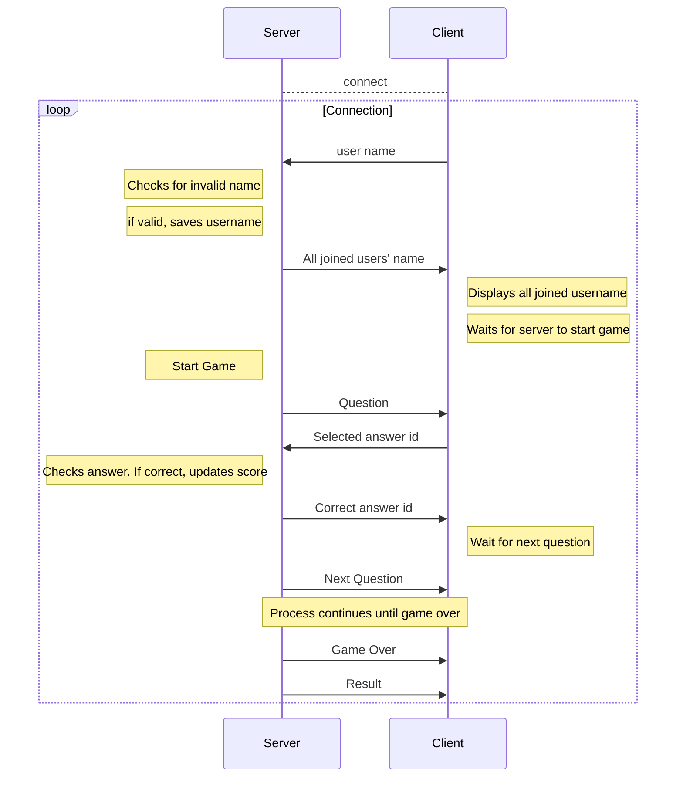
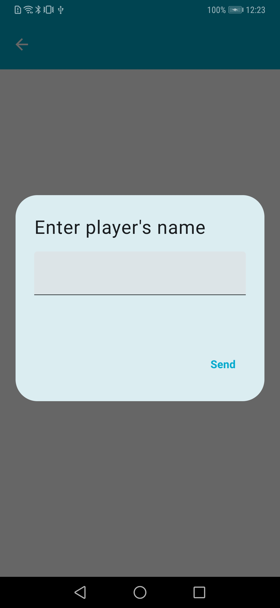
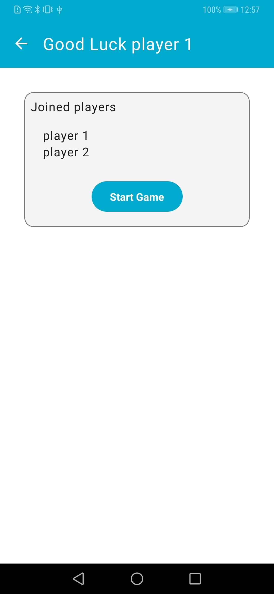
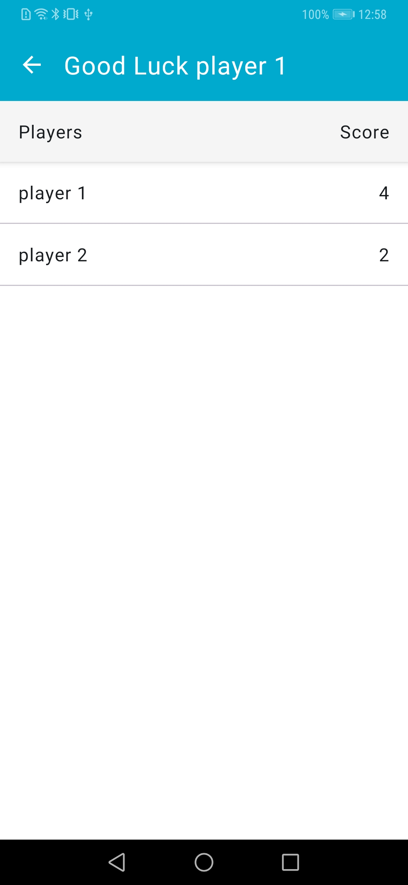

# Introduction
## Client-Server Connection
An example Android application demonstrating client-server interaction.
The _BleServerManager_ is responsible to open the Gatt server and initializing services.
The server will [advertise](https://source.android.com/docs/core/connect/bluetooth/ble_advertising)
the services through GATT server using a randomly generated service 
UUID and make Gatt services available to remote scanning devices.

The client, on the other hand, will start scanning for an advertising device with the 
same service UUID and connect with the one it discovers first. 
Once the connection is established, both the client and the server start interacting with each other.
A [BleManager](https://github.com/NordicSemiconductor/Android-BLE-Library/blob/sample/README.md#features) 
instance is responsible for connecting and communicating with a peripheral device.

## Data transmission between client and server
The transmission of the data between the client and server is performed using the 
Protocol Buffer ([Protobuf](https://developers.google.com/protocol-buffers)).
Protobuf is more efficient than text-based formats (such as JSON) in terms of speed and code size, 
making it more suitable for use in mobile environments.
[Wire Compiler](https://square.github.io/wire/wire_compiler/#wire-compiler-gradle-plugin) 
has been utilized to compile the Protobuf in this project.  

Data transmission between client and server is depicted in the diagram.


## About the game
This is a simple quiz game that could be played by multiple players.
It includes a server that will host the game and one or more clients.
Each participant will be given a question and multiple answers from which they must choose one.
A timer will appear at the top of the screen, allowing the user to choose the correct answer within
a given time limit. Only one response per question will be allowed.
Once the timer is off, the right answer will be highlighted on each player's screen.
If the user's selection is correct, it will be highlighted in green; otherwise,
it will be highlighted in red. At the end of the game, all players' scores will be distributed. 
A total of ten questions collected from an open source [Trivia&NonBreakingSpace;API](https://opentdb.com/api_config.php)
will be presented. 

       

# Requirements
- The application depends on [Android BLE Library](https://github.com/NordicSemiconductor/Android-BLE-Library/)
- Android 4.3 or newer is required.

## Required permissions 
On Android 6 - 11, it will ask for Location Permission and Location services. This permission is 
required on Android in order to obtain Bluetooth LE scan and advertise results. 
This permission is not required from Android 12 onwards, where new [Bluetooth permissions](https://developer.android.com/guide/topics/connectivity/bluetooth/permissions)
were introduced. 
The BLUETOOTH_SCAN permission can now be requested with ```usesPermissionFlags="neverForLocation"``` 
parameter, which excludes location related data from the scan results, making requesting location not needed anymore.

Furthermore, internet access permission is needed to retrieve the question data from the Trivia API.
